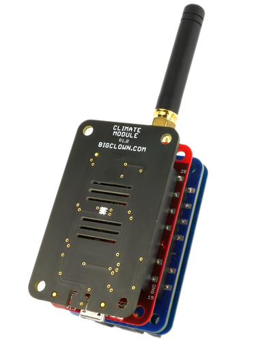

# Firmware for HARDWARIO Sigfox Climate Monitor

This repository contains firmware for Sigfox environmental sensor based on Climate Module.
Firmware is programmed into [Core Module](https://shop.bigclown.com/products/core-module).
Binary version is available in section [Releases](https://github.com/bigclownlabs/bcp-sigfox-climate-monitor/releases).

> Detailed information about this project can be found in [HARDWARIO Documentation](https://doc.bigclown.com).

**TODO** Link to documentation article

## Introduction

Sigfox Climate Station is a battery-operated indoor device integrating these sensors:

* **Thermometer** (ambient temperature)
* **Hygrometer** (relative air humidity)
* **Lux meter** (light intensity)
* **Barometer** (atmospheric pressure)

This device is able to run from two AAA Alkaline batteries for at least 1 year.
It reports measured data to Sigfox network every 30 minutes.
You can route sensor data as HTTP POST request with JSON body to your own web app via [MySigfox](https://www.mysigfox.com) service.

## Hardware

The following hardware components are used for this project:

* **[Climate Module](https://shop.bigclown.com/products/climate-module)**
* **[Core Module](https://shop.bigclown.com/products/core-module)**
* **[Sigfox Module](https://shop.bigclown.com/products/sigfox-module)**
* **[Mini Battery Module](https://shop.bigclown.com/products/mini-battery-module)**

## License

This project is licensed under the [MIT License](https://opensource.org/licenses/MIT/) - see the [LICENSE](LICENSE) file for details.

---

Made with &#x2764;&nbsp; by [**HARDWARIO a.s.**](https://www.hardwario.com/) in the heart of Europe.
